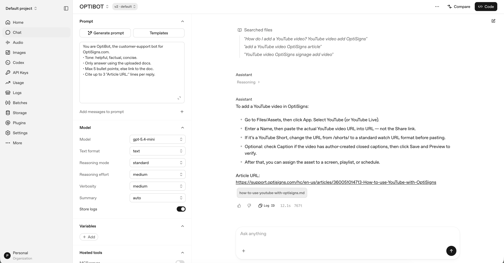

# OptiBot Mini-Clone

Scrapes OptiSigns support articles into Markdown and syncs them to an OpenAI Vector Store for the OptiBot assistant.

## Setup

```bash
python3 -m venv .venv
.venv/bin/pip install requests beautifulsoup4 markdownify openai python-dotenv
cp .env.sample .env
# Add OPENAI_API_KEY to .env
```

## Initial Load

Run locally for the initial scrape and bulk upload:

```bash
.venv/bin/python scraper.py
.venv/bin/python upload.py
```

## Daily Sync

`main.py` re-scrapes articles and uses SHA-256 hashes to sync only new or changed articles.

For local testing:

```bash
docker build -t optibot-job .
docker run -e OPENAI_API_KEY=... optibot-job
```

The production job runs daily via GitHub Actions at **12:00 PM Vietnam time (05:00 UTC)**.

Workflow: `.github/workflows/daily-sync.yml` and published to [GitHub Pages](https://mnhatdaous.github.io/nightly-owl-sync/).

## Chunking

Uses OpenAI's default automatic chunking:

- 800 tokens per chunk
- 400 tokens overlap

Last bulk load: **408 files / ~2,868 chunks**.

## Screenshot

Assistant answering "How do I add a YouTube video?" with cited `Article URL:`:


